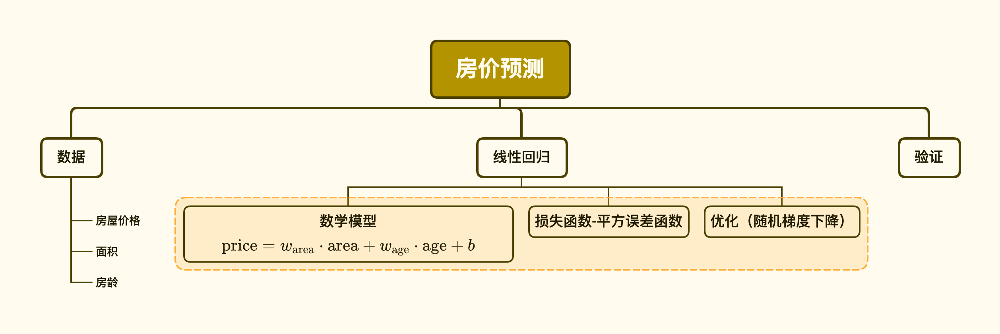

# 线性回归模型

## 整体概览

## 章节核心知识

* 线性模型的数学表示
* 线性模型的解析解
* 线性模型的从头实现和简洁实现
* 线性模型梯度的计算

### 线性模型

用符号表示的矩阵 $\mathbf{X} \in \mathbb{R}^{n \times d}$ 可以很方便地引用我们整个数据集的 $n$ 个样本。其中，$\mathbf{X}$ 的每一行是一个样本，每一列是一种特征。

对于特征集合 $\mathbf{X}$ ，预测值 $\hat{\mathbf{y}} \in \mathbb{R}^n$ 可以通过矩阵-向量乘法表示为：

$${\hat{\mathbf{y}}} = \mathbf{X} \mathbf{w} + b$$

### 损失函数

*损失函数* 能够量化目标的*实际*值与*预测* 值之间的差距。通常我们会选择非负数作为损失，且数值越小表示损失越小，完美预测时的损失为0。回归问题中最常用的损失函数是平方误差函数。当样本 $i$ 的预测值为 $\hat{y}^{(i)}$，其相应的真实标签为 $y^{(i)}$ 时，平方误差可以定义为以下公式：

$$l^{(i)}(\mathbf{w}, b) = \frac{1}{2} \left(\hat{y}^{(i)} - y^{(i)}\right)^2.$$

常数$\frac{1}{2}$不会带来本质的差别，但这样在形式上稍微简单一些，表现为当我们对损失函数求导后常数系数为1。

由于平方误差函数中的二次方项，估计值 $\hat{y}^{(i)}$ 和观测值 $y^{(i)}$ 之间较大的差异将贡献更大的损失。为了度量模型在整个数据集上的质量，我们需计算在训练集$n$个样本上的损失均值（也等价于求和）。

$$L(\mathbf{w}, b) =\frac{1}{n}\sum_{i=1}^n l^{(i)}(\mathbf{w}, b) =\frac{1}{n} \sum_{i=1}^n \frac{1}{2}\left(\mathbf{w}^\top \mathbf{x}^{(i)} + b - y^{(i)}\right)^2.$$

在训练模型时，我们希望寻找一组参数 ($\mathbf{w}^*, b^*$)，这组参数能最小化在所有训练样本上的总损失。如下式：

$$\mathbf{w}^*, b^* = \operatorname*{argmin}_{\mathbf{w}, b}\  L(\mathbf{w}, b).$$

### 小批量随机梯度下降

算法的步骤如下：（1）初始化模型参数的值，如随机初始化；（2）从数据集中随机抽取小批量样本且在负梯度的方向上更新参数，并不断迭代这一步骤。对于平方损失和仿射变换，我们可以明确地写成如下形式:

$$\begin{aligned} \mathbf{w} &\leftarrow \mathbf{w} -   \frac{\eta}{|\mathcal{B}|} \sum_{i \in \mathcal{B}} \partial_{\mathbf{w}} l^{(i)}(\mathbf{w}, b) = \mathbf{w} - \frac{\eta}{|\mathcal{B}|} \sum_{i \in \mathcal{B}} \mathbf{x}^{(i)} \left(\mathbf{w}^\top \mathbf{x}^{(i)} + b - y^{(i)}\right),\\ b &\leftarrow b -  \frac{\eta}{|\mathcal{B}|} \sum_{i \in \mathcal{B}} \partial_b l^{(i)}(\mathbf{w}, b)  = b - \frac{\eta}{|\mathcal{B}|} \sum_{i \in \mathcal{B}} \left(\mathbf{w}^\top \mathbf{x}^{(i)} + b - y^{(i)}\right). \end{aligned}$$

在训练了预先确定的若干迭代次数后（或者直到满足某些其他停止条件后），我们记录下模型参数的估计值，表示为$\hat{\mathbf{w}}, \hat{b}$。但是，即使我们的函数确实是线性的且无噪声，这些估计值也不会使损失函数真正地达到最小值。因为算法会使得损失向最小值缓慢收敛，但却不能在有限的步数内非常精确地达到最小值。

上述优化公式的详细推导步骤

## 拓展阅读

* 极大似然估计
* 噪声对模型的影响
* 如何理解*泛化* (generalization)

### 练习题解答：

1. 假设我们有一些数据 $x_1, \ldots, x_n \in \mathbb{R}$。我们的目标是找到一个常数$b$，使得最小化 $\sum_i (x_i - b)^2$。
    1. 找到最优值 $b$ 的解析解。
    1. 这个问题及其解与正态分布有什么关系?
1. 推导出使用平方误差的线性回归优化问题的解析解。为了简化问题，可以忽略偏置$b$(我们可以通过向 $\mathbf X$ 添加所有值为1的一列来做到这一点)。
    1. 用矩阵和向量表示法写出优化问题(将所有数据视为单个矩阵，将所有目标值视为单个向量)。
    1. 计算损失对$w$的梯度。
    1. 通过将梯度设为0、求解矩阵方程来找到解析解。
    1. 什么时候可能比使用随机梯度下降更好？这种方法何时会失效？
1. 假定控制附加噪声 $\epsilon$ 的噪声模型是指数分布。也就是说，$p(\epsilon) = \frac{1}{2} \exp(-|\epsilon|)$
    1. 写出模型 $-\log P(\mathbf y \mid \mathbf X)$ 下数据的负对数似然。
    1. 你能写出解析解吗？
    1. 提出一种随机梯度下降算法来解决这个问题。哪里可能出错？（提示：当我们不断更新参数时，在驻点附近会发生什么情况）你能解决这个问题吗？