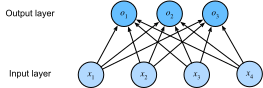

# 线性回归模型

## 整体概览

## 章节核心知识

* SoftmaxRegression的数学表示
* SoftmaxRegression的从头实现和简洁实现
* SoftmaxRegression梯度的计算

## Softmax Regression

为了更简洁地表达模型，我们仍然使用线性代数符号。
通过向量形式表达为$\mathbf{o} = \mathbf{W} \mathbf{x} + \mathbf{b}$，这是一种更适合数学和编写代码的形式。

社会科学家邓肯·卢斯于1959年在*选择模型*（choice model）的背景下发明的*softmax函数*正是这样做的。
为了将未归一化的预测变换为非负并且总和为1，同时要求模型保持可导。我们首先对每个未归一化的预测求幂，这样可以确保输出非负。为了确保最终输出的总和为1，我们再对每个求幂后的结果除以它们的总和。如下式：

$$\hat{\mathbf{y}} = \mathrm{softmax}(\mathbf{o})\quad \text{其中}\quad \hat{y}_j = \frac{\exp(o_j)}{\sum_k \exp(o_k)}$$

容易看出对于所有的$j$总有$0 \leq \hat{y}_j \leq 1$。因此，$\hat{\mathbf{y}}$可以视为一个正确的概率分布。softmax运算不会改变未归一化的预测$\mathbf{o}$之间的顺序，只会确定分配给每个类别的概率。因此，在预测过程中，我们仍然可以用下式来选择最有可能的类别。

$$
\operatorname*{argmax}_j \hat y_j = \operatorname*{argmax}_j o_j.
$$

尽管softmax是一个非线性函数，但softmax回归的输出仍然由输入特征的仿射变换决定。因此，softmax回归是一个线性模型。

## 损失函数

### 对数似然

softmax函数给出了一个向量$\hat{\mathbf{y}}$，我们可以将其视为给定任意输入$\mathbf{x}$的每个类的估计条件概率。例如，$\hat{y}_1$=$P(y=\text{猫} \mid \mathbf{x})$。假设整个数据集$\{\mathbf{X}, \mathbf{Y}\}$具有$n$个样本，其中索引$i$的样本由特征向量$\mathbf{x}^{(i)}$和独热标签向量$\mathbf{y}^{(i)}$组成。我们可以将估计值与实际值进行比较：

$$
P(\mathbf{Y} \mid \mathbf{X}) = \prod_{i=1}^n P(\mathbf{y}^{(i)} \mid \mathbf{x}^{(i)}).
$$

根据最大似然估计，我们最大化$P(\mathbf{Y} \mid \mathbf{X})$，相当于最小化负对数似然：

$$
-\log P(\mathbf{Y} \mid \mathbf{X}) = \sum_{i=1}^n -\log P(\mathbf{y}^{(i)} \mid \mathbf{x}^{(i)})
= \sum_{i=1}^n l(\mathbf{y}^{(i)}, \hat{\mathbf{y}}^{(i)}),
$$

其中，对于任何标签$\mathbf{y}$和模型预测$\hat{\mathbf{y}}$，损失函数为：

$$ l(\mathbf{y}, \hat{\mathbf{y}}) = - \sum_{j=1}^q y_j \log \hat{y}_j. $$

在本节稍后的内容会讲到， :eqref:`eq_l_cross_entropy`中的损失函数通常被称为*交叉熵损失*（cross-entropy loss）。由于$\mathbf{y}$是一个长度为$q$的独热编码向量，所以除了一个项以外的所有项$j$都消失了。由于所有$\hat{y}_j$都是预测的概率，所以它们的对数永远不会大于$0$。
因此，如果正确地预测实际标签，即，如果实际标签$P(\mathbf{y} \mid \mathbf{x})=1$，则损失函数不能进一步最小化。
注意，这往往是不可能的。例如，数据集中可能存在标签噪声（某些样本可能被误标），或输入特征没有足够的信息来完美地对每一个样本分类。

由于softmax和相关的损失函数很常见，因此值得我们更好地理解它的计算方式。将 :eqref:`eq_softmax_y_and_o`代入损失 :eqref:`eq_l_cross_entropy`中。利用softmax的定义，我们得到：

$$
\begin{aligned}
l(\mathbf{y}, \hat{\mathbf{y}}) &=  - \sum_{j=1}^q y_j \log \frac{\exp(o_j)}{\sum_{k=1}^q \exp(o_k)} \\
&= \sum_{j=1}^q y_j \log \sum_{k=1}^q \exp(o_k) - \sum_{j=1}^q y_j o_j\\
&= \log \sum_{k=1}^q \exp(o_k) - \sum_{j=1}^q y_j o_j.
\end{aligned}
$$

为了更好地理解发生了什么，考虑相对于任何未归一化的预测$o_j$的导数。我们得到：

$$
\partial_{o_j} l(\mathbf{y}, \hat{\mathbf{y}}) = \frac{\exp(o_j)}{\sum_{k=1}^q \exp(o_k)} - y_j = \mathrm{softmax}(\mathbf{o})_j - y_j.
$$

换句话说，导数是我们模型分配的概率（由softmax得到）与实际发生的情况（由独热标签向量表示）之间的差异。从这个意义上讲，与我们在回归中看到的非常相似，其中梯度是观测值$y$和估计值$\hat{y}$之间的差异。这不是巧合，在任何指数族分布（参见[关于分布的在线附录](https://d2l.ai/chapter_appendix-mathematics-for-deep-learning/distributions.html)）模型中，对数似然的梯度正是由这给出的。这使梯度计算在实践中变得容易。

## 拓展阅读

### 练习题解答：

1. 我们可以更深入地探讨指数族与softmax之间的联系。
    1. 计算softmax交叉熵损失$l(\mathbf{y},\hat{\mathbf{y}})$的二阶导数。
    1. 计算$\mathrm{softmax}(\mathbf{o})$给出的分布方差，并与上面计算的二阶导数匹配。
1. 假设我们有三个类发生的概率相等，即概率向量是$(\frac{1}{3}, \frac{1}{3}, \frac{1}{3})$。
    1. 如果我们尝试为它设计二进制代码，有什么问题？
    1. 你能设计一个更好的代码吗？提示：如果我们尝试编码两个独立的观察结果会发生什么？如果我们联合编码$n$个观测值怎么办？
1. softmax是对上面介绍的映射的误称（但深度学习中的每个人都使用它）。真正的softmax被定义为$\mathrm{RealSoftMax}(a, b) = \log (\exp(a) + \exp(b))$。
    1. 证明$\mathrm{RealSoftMax}(a, b) > \mathrm{max}(a, b)$。
    1. 证明$\lambda^{-1} \mathrm{RealSoftMax}(\lambda a, \lambda b) > \mathrm{max}(a, b)$成立，前提是$\lambda > 0$。
    1. 证明对于$\lambda \to \infty$，有$\lambda^{-1} \mathrm{RealSoftMax}(\lambda a, \lambda b) \to \mathrm{max}(a, b)$。
    1. soft-min会是什么样子？
    1. 将其扩展到两个以上的数字